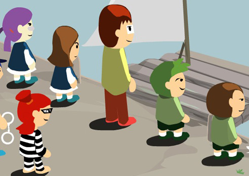

# Family River Crossing Puzzle Analysis

## Notes
> I'll be honest with you here, Right now i am busy on some other projects. I will pick this up again in July 2023.

Family River Crossing Puzzle is a game in which players work together to cross a river using a raft, following rules and minimizing trips. This repository analyzes the smallest number of moves and ways to solve the puzzle.

## The Puzzle
Family River Crossing Puzzle is a game in which a family consisting of a mother, father, two daughters, and two sons, along with a cop and a criminal, must all cross a river using a raft. The raft is the only means of transportation available, and it has a limited capacity of two people at a time. The challenge of the game is to figure out the optimal way to get everyone across the river while following the rules and minimizing the number of trips required. The puzzle can be played by a single person or by a group, with each player taking on the role of one of the characters and working together to come up with a solution.

In this repository, you will find the original SWF version of the Family River Crossing Puzzle game. To play it, you will need to install Flash Player (note: this is not recommended due to security concerns). Alternatively, you can use a flash emulator, although it may not work properly. If you prefer not to use Flash, you can also play an alternate web version of the game at the following link: [https://tortillawrapper.itch.io/family-river-cross-puzzle](https://tortillawrapper.itch.io/family-river-cross-puzzle). Please note that this alternate version may not be identical to the original game.

## The Rules
There are five rules that must be followed when solving the puzzle:
1. The raft can carry only 2 people.
2. The father can not be left with any of the daughters unless the mother is present.
3. The mother can not be left with any of the sons unless the father is present.
4. The criminal can not stay with any family member unless the cop is present.
5. Only the father, mother, and cop know how to use the raft.

## The Analysis
This Repository serves as a working analysis to solve the following question:
1. What is the smallest number of moves do you need to solve this puzzle?
2. How many different way can you do to solve this puzzle?
3. What can we infer from this game?

## Lesson Learned (TODO)

### Some Key Insight
* There are 8 different correct answer.
* Each of them differs on how the kids moves.
* Its a permutation on which kids moves first.

